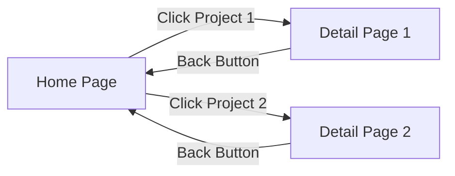

# AI-Powered Portfolio Website Builder

A modern, responsive, dynamic, and multilingual portfolio built with Svelte, GSAP, and TailwindCSS, featuring dynamic content fetched from a WordPress backend.

## Technologies Used

* [Svelte](https://svelte.dev/)
* [GSAP](https://gsap.com/)
* [TailwindCSS](https://tailwindcss.com/)
* [WordPress](https://developer.wordpress.org/rest-api/)
* [MySQL](https://www.mysql.com/)
* [Apache](https://httpd.apache.org/)
* [Google Gemini AI](https://ai.google.dev/gemini-api/)

## Technology Overview

### 1. Svelte

Used to build a fast, reactive, and maintainable frontend with compiler-based optimizations.

### 2. GSAP

Integrated for high-performance animations and smooth micro-interactions, enhancing user experience.

### 3. TailwindCSS

Adopted for rapid styling and maintaining a consistent design system.

### 4. WordPress

Used in two ways for maximum flexibility:

* **Headless CMS Backend:**

  * Acts as a decoupled content repository
  * Exposes data via REST API
  * Utilizes Advanced Custom Fields (ACF) for custom post types and intuitive content modeling

* **Traditional Frontend Builder:**

  * Uses WordPress’s templating system for marketing pages
  * Employs Elementor for dynamic, reusable layouts and visual page building

### 5. MySQL

Relational database management system for reliable data storage and retrieval.

### 6. Apache

Configured as the web server to host and serve the website reliably and efficiently.

---

## Project Architecture

This portfolio demonstrates two approaches to modern web development for flexibility and performance:

### Decoupled Architecture

* **Frontend:** Built with Svelte for speed and responsiveness
* **Backend:** WordPress as Headless CMS with custom post types and REST API

### Traditional WordPress Implementation

* Full WordPress stack using Elementor for visual page building and theme customization

---

## Website Structure



> **Note:** This Mermaid diagram renders best in markdown viewers that support Mermaid.js (e.g., GitHub, VS Code with plugin).

### Portfolio Home Page Sections

* **Hero:** Animated intro with profile image, name, and summary using GSAP
* **Skills:** Animated skill cards with scroll-triggered entrance and hover effects
* **Projects:** Dynamically loaded project cards with specified **filters** from WordPress REST API, responsive grid, and GSAP animations
* **Footer:** Contact info with animated social links and hover effects
* **Multilingual Support:** Language switcher toggling between English and Persian, powered by a translation store

### Project Detail Page

* Comprehensive project info including description, images, technical specs, and repository links

---

## WordPress Plugins Used

* **Advanced Custom Fields (ACF):** For creating custom fields and the 'Projects' post type
* **Classic Editor:** Provides a stable editing interface, especially when used with ACF
* **Elementor Pro:** Visual page builder for flexible, responsive layouts without custom CSS
* **Projects Count Shortcode (Custom Plugin):** Displays total published projects using the `[project_count]` shortcode

---

## Setup Instructions

### 1. Install Local Server (MySQL + Apache)

* Download and install [XAMPP](https://www.apachefriends.org/)
* Launch XAMPP Control Panel and start Apache and MySQL modules
* Open [phpMyAdmin](http://localhost/phpmyadmin), create a new database for WordPress
* (Optional) Set a root password in MySQL:

  * Go to **User Accounts**, edit `root@localhost`, and set a password
  * Update `C:\xampp\phpMyAdmin\config.inc.php`:

  ```php
  $cfg['Servers'][$i]['password'] = 'your_password_here';
  ```

### 2. Clone the Repository

```bash
cd "C:\xampp\htdocs\"
git clone https://github.com/Default-Mat/Portfolio-Builder.git
```

### 3. Setup Svelte Frontend

```bash
cd "C:\xampp\htdocs\portfolio-svelte"
npm install
npm install tailwindcss @tailwindcss/vite gsap
```

### 4. Setup WordPress Backend

* Download and extract [WordPress](https://wordpress.org/download/) into `C:\xampp\htdocs\portfolio-wp`
* Visit [http://localhost/portfolio-wp](http://localhost/portfolio-wp) and follow the installation steps
* Use the database and credentials configured earlier
* In WordPress admin, activate the plugins: ACF, Classic Editor, Elementor Pro, and the custom Projects Count plugin
* Activate the “Hello Elementor” theme

### 5. Define Custom Post Types and Fields

#### Profile Post Type

* **Fields:**

  * `name`, `نام` — Full name in English and Persian
  * `title`, `عنوان` — Job title in English and Persian
  * `bio`, `شرح` — Bio in English and Persian
  * `avatar` — Image field for profile picture
  * `skills`, `projects`, `social_links` — Relationship fields to respective post types

#### Projects Post Type

* Already described in setup steps
* **Fields:**

  * `عنوان`, `description`, `توضیحات`, `technologies`, `URL`, `image`

#### Skills Post Type

* **Fields:**

  * `عنوان`, `technologies`

#### Social Links Post Type

* **Fields:**

  * `platform name`, `بستر`, `URL`

Make sure all post types are set to **show in REST API** under ACF → Post Types.

### 6. Run the Svelte Development Server

```bash
cd "C:\xampp\htdocs\portfolio-svelte"
npm run dev
```

Open the local URL shown in your terminal to view the portfolio.

---

## Custom Features

### AI-Powered Project Post Suggestions

Integrated with Google Gemini AI API for one-click project post suggestions. Modify the API key and behavior in:

```
\xampp\htdocs\portfolio-wp\wp-content\themes\hello-elementor\js\gemini-ai.js
```

> **Security Note:** Never commit your real API key to public repos. Use environment variables or `.env` files for sensitive keys.

### Projects Count Shortcode Plugin

A custom plugin that displays the number of available projects via the `[project_count]` shortcode. Modify the plugin script at:

```
C:\xampp\htdocs\portfolio-wp\wp-content\plugins\projects-count-shortcode\projects-count-shortcode-script.php
```

---

## Usage

* Use the language switcher at the top to toggle languages
* Projects load dynamically from WordPress REST API
* Enjoy smooth entrance and hover animations powered by GSAP and ScrollTrigger
* Use the footer’s animated social/contact buttons to connect

---

## Customization

* Add or remove languages by editing the translation store and language switcher
* Adjust GSAP animations in the `.svelte` component files
* Update the WordPress API endpoint URL in `+page.svelte` if your backend URL changes
