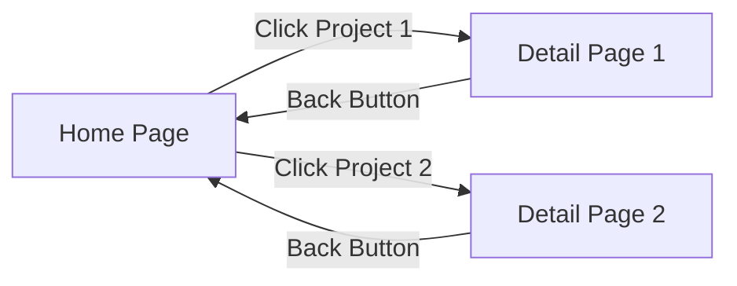

# 🧠✨ AI-Powered Portfolio Website Builder

A modern, responsive, dynamic, and multilingual portfolio built with Svelte, GSAP, and TailwindCSS, featuring dynamic content fetched from a WordPress backend.

---

## 🛠️ Technologies Used

* ⚡ [Svelte](https://svelte.dev/)
* 🎞️ [GSAP](https://gsap.com/)
* 🎨 [TailwindCSS](https://tailwindcss.com/)
* 📝 [WordPress](https://developer.wordpress.org/rest-api/)
* 🛢️ [MySQL](https://www.mysql.com/)
* 🌐 [Apache](https://httpd.apache.org/)
* 🤖 [Google Gemini AI](https://ai.google.dev/gemini-api/)

---

## 📚 Technology Overview

### ⚡ Svelte

Used to build a fast, reactive, and maintainable frontend with compiler-based optimizations.

### 🎞️ GSAP

Integrated for high-performance animations and smooth micro-interactions, enhancing user experience.

### 🎨 TailwindCSS

Adopted for rapid styling and maintaining a consistent design system.

### 📝 WordPress

Used in two ways for maximum flexibility:

* **Headless CMS Backend**
* **Traditional Frontend Builder**

### 🛢️ MySQL

Reliable relational database system for storing custom post types and content.

### 🌐 Apache

Serves the website locally or in production environments via XAMPP.

---

## 🧱 Project Architecture

### ⚙️ Decoupled Architecture

* 🧩 Frontend: Built with Svelte
* 📡 Backend: WordPress as Headless CMS via REST API

### 🖥️ Traditional WordPress

Full WordPress stack using Elementor for no-code dynamic page building.

---

## 🗺️ Website Structure



### 📌 Home Page Sections

* 🎯 Hero Section – Animated intro with GSAP (**dynamic content fetched from WordPress ACF fields**)
* 🛠️ Skills – Scroll-triggered skill cards (**dynamic content fetched from WordPress ACF fields**)
* 💼 Projects – Dynamic WordPress-loaded projects accessible by technology filtering (**fetched via REST API from custom post type**)
* 🔗 Footer – Contact info and social links (**dynamic data from ACF-based social links post type**)
* 🌍 Multilingual Support – Switch between English 🇬🇧 and Persian 🇮🇷

---

## 🧩 Projects Detail Page

* 📝 Full project descriptions
* 🖼️ Image galleries
* 🧪 Technical stack
* 🔗 Links to repos/demo

---

## 🔌 WordPress Plugins Used

* ⚙️ Advanced Custom Fields (ACF)
* 📝 Classic Editor
* 🧰 Elementor Pro
* 🔢 Projects Count Shortcode (custom plugin)

---

## 🚀 Setup Instructions

### 1️⃣ Install Local Server ([XAMPP](https://www.apachefriends.org/)) 🧪

* 🔧 Start Apache & MySQL
* ⚙️ Create WordPress DB in phpMyAdmin
* 🔐 Optional: Set a MySQL root password

### 2️⃣ Clone the Repository 💾

```bash
cd "C:\xampp\htdocs\"
git clone https://github.com/Default-Mat/Portfolio-Builder.git
```

### 3️⃣ Setup Svelte Frontend ⚡

```bash
cd "C:\xampp\htdocs\portfolio-svelte"
npm install
npm install tailwindcss @tailwindcss/vite gsap
```

### 4️⃣ Setup WordPress Backend 📝

* Download WordPress into `C:\xampp\htdocs\portfolio-wp`
* Visit `localhost/portfolio-wp` to install and config
* Activate Plugins:

  * ACF
  * Classic Editor
  * Elementor Pro
  * Custom Projects Count Plugin
* Activate Theme: **Hello Elementor**

---

## 🧩 Define Custom Post Types and Fields

### 👤 Profile Post Type

| Field Name                           | Purpose                           |
| ------------------------------------ | --------------------------------- |
| `name`, `نام`                        | Full name in English and Persian  |
| `title`, `عنوان`                     | Job title                         |
| `bio`, `شرح`                         | Short biography                   |
| `avatar`                             | Profile image                     |
| `skills`, `projects`, `social_links` | Relationships to other post types |

### 💼 Projects Post Type

| Field Name     | Description               |
| -------------- | ------------------------- |
| `عنوان`        | Project title (Persian)   |
| `description`  | Project description |
| `توضیحات`      | (Persian) project explanation  |
| `technologies` | Technologies used         |
| `URL`          | Link to project/demo/repo |
| `image`        | Featured image            |

### 🛠️ Skills Post Type

| Field Name     | Description              |
| -------------- | ------------------------ |
| `عنوان`        | Skill name (Persian)     |
| `technologies` | Related tools/tech stack |

### 🔗 Social Links Post Type

| Field Name              | Description              |
| ----------------------- | ------------------------ |
| `platform name`, `بستر` | Name of platform (EN/FA) |
| `URL`                   | Link to social profile   |

📌 Ensure **Show in REST API** is enabled for all post types in ACF → Post Types.

---

### 5️⃣ Run the Svelte Dev Server ⚡

```bash
cd "C:\xampp\htdocs\portfolio-svelte"
npm run dev
```

---

## 🧠 Custom Features

### 🤖 AI-Powered Project Post Suggestions

* Integrated with Google Gemini API
* One-click post generator

📂 Modify behavior in:

```
\xampp\htdocs\portfolio-wp\wp-content\themes\hello-elementor\js\gemini-ai.js
\xampp\htdocs\portfolio-wp\wp-content\themes\hello-elementor\gemini-proxy.php
```

🔐 **Security Note**: Don’t commit API keys. Use `.env` files.

---

### 🔢 Projects Count Shortcode Plugin

Custom plugin to display project count using:

```shortcode
[project_count]
```

📂 Plugin path:

```
C:\xampp\htdocs\portfolio-wp\wp-content\plugins\projects-count-shortcode\projects-count-shortcode-script.php
```

---

## 💾 Automated MySQL Backups

### 🧰 Backup Script

A script (`db_backup_script.php`) located in your WordPress folder backs up your MySQL database:

```
portfolio-wp/db_backup_script.php
```

You can manually run this or schedule it using OS tools.

---

### 🕒 Linux: Add Cron Job

1. Open crontab:

```bash
crontab -e
```

2. Add a scheduled job:

```bash
0 3 * * * /usr/bin/php /path/to/portfolio-wp/db_backup_script.php >> /var/log/db_backup.log 2>&1
```

⏰ This runs daily at 3 AM.

---

### 🪟 Windows: Add Task Scheduler Job

1. Open **Task Scheduler**
2. Create a task:

   * **Trigger:** Daily at preferred time
   * **Action:** Start a program → `php.exe`
   * **Arguments:** `C:\xampp\htdocs\portfolio-wp\db_backup_script.php`
   * **Start In:** `C:\xampp\htdocs\portfolio-wp\`

✅ Done! Backups now run on a schedule.

---

## 💡 Usage

* 🌍 Switch between languages
* 🔄 Projects load dynamically from WordPress
* 🎞️ Smooth animations using GSAP
* 📱 Animated social/contact links in footer

---

## 🎨 Customization

* 🌐 Edit translations for new languages
* 🎞️ Adjust GSAP animations in `.svelte` files
* 🔧 Update REST API URLs in `+page.svelte`
